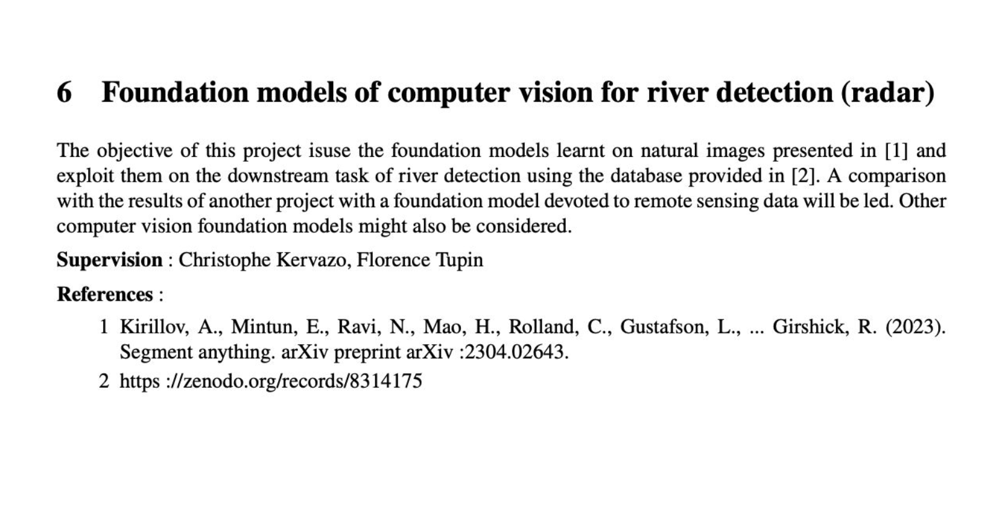

# projet_remote

[MVA][Remote] Foundation models of computer vision for river detection

## Segment Anything

pip install git+https://github.com/facebookresearch/segment-anything.git

pip install opencv-python pycocotools matplotlib onnxruntime onnx
